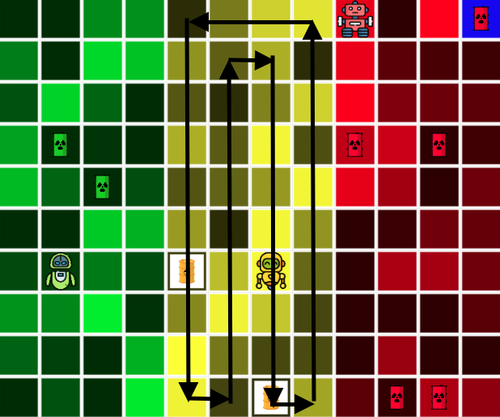
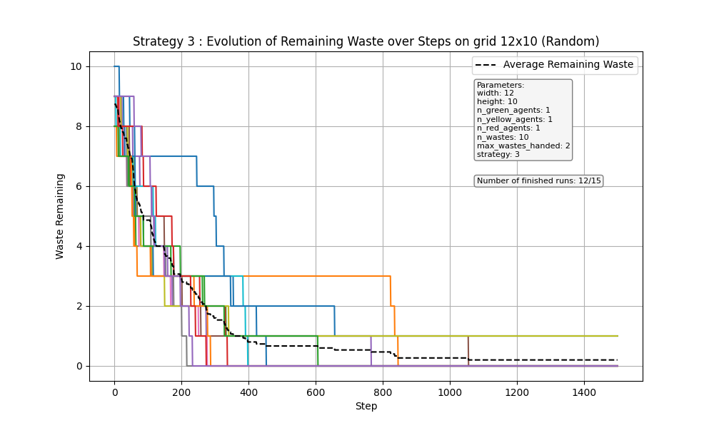
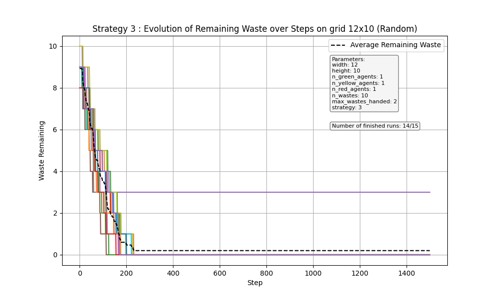
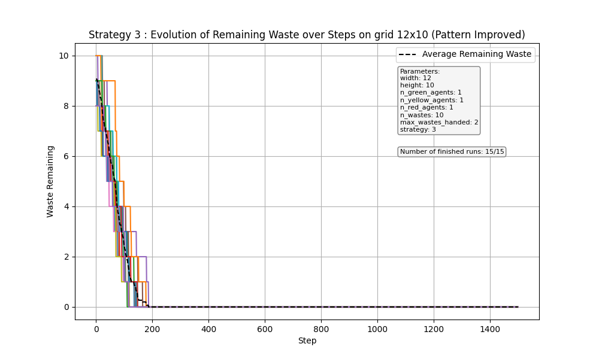
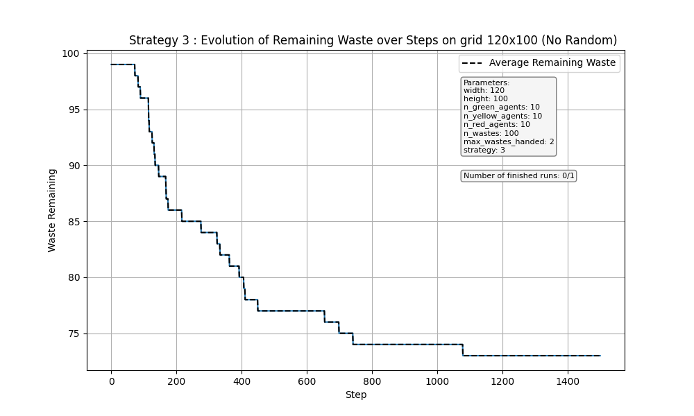
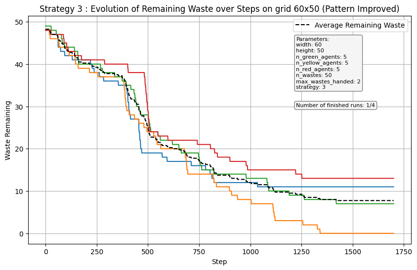
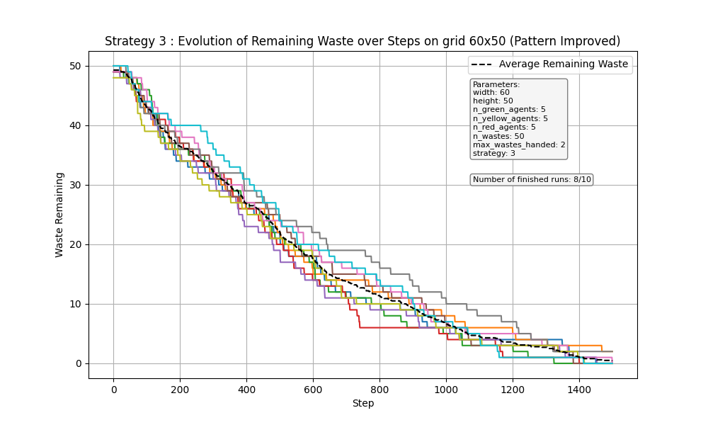

# MAS-nuclear-wates

MAS (Multi Agent System) project : create different agents in a environnement to clear 3 areas with nuclear wastes.

Group 10

## Run the simulation

First, install the requirements ! (see the file `requirements.txt`)

Run the simulation and see the visualization :

`python3 ./robot_mission_10/server.py`

Run the simulation on N iterration and get the graph of the global performance :

`python3 ./robot_mission_10/run.py`

## Table of Contents

1. [Project Introduction](#project-introduction)
2. [Environment](#environment)
3. [Agents](#agents)
4. [Environmental Objects](#environmental-objects)
5. [Scheduler](#scheduler)
6. [Strategies](#strategies)

## Project Introduction

We are on a hazardous terrain filled with radioactive waste. The terrain is divided into 3 zones from West to East. Each zone (green-yellow-red) has different levels of radioactivity, which limits certain robots to certain zones. Here are the three types of robots:

- **Green Robot**: can carry two green wastes at a time. Once it has two green wastes, it can merge them into a yellow waste that it will transport east. This robot cannot move to any zone other than the green zone.
- **Yellow Robot**: can carry two yellow wastes at a time. Once in hand, it can merge them into a red waste that it will transport east. This robot can only move in the green and yellow zones.
- **Red Robot**: Can only pick up one red waste at a time and moves it to the disposal zone in the east. It can move across all zones.

The project's goal is to clean up the area with multiple agents picking up waste, merging it, and bringing it to the east side of the zone.

## Environment

The environment is responsible for initially initializing all agents and placing them on the terrain grid.

It is also here that we collect the data for further analysis of the simulation. Thus, at each step, we record in a dataframe the position of each agent as well as its knowledge if it has any. We can also use this class to visualize in live the simulation (in the file `server.py`).

Finally, it is in the environment that we define the do function that agents call to perform an action. This function is implemented with a functional paradigm. If an agent want to do something, it has to return an action in this list : `LEFT`, `RIGHT`, `UP`, `DOWN`, `TAKE`, `DROP`, `MERGE`, `STAY`. The handler for each of these actions are defined in the file `action.py`. These action, when are call, ask the environment to perform the action. If it is not possible because the envrionment thinks it as against the rule (e.g. going outside the grid), it raises an error and the action handler return to the agent its last percep. So, if an agent wants to know if its action has been performed, it can compares its last two percepts.

The code for the environment is found in the `model.py` file.

## Agents

We have three different agent classes with different behaviors: RobotGreen, RobotYellow, and RobotRed.
The structure of each agent remains the same:

- **Internal Variables**: we group the agent's beliefs in the knowledge variable. There is also the percepts variable, which groups information returned by the environment after an action. Knowledge is therefore a dictionary in which we find the following fields:

  - **Percepts**: a list of percepts
  - **Actions**: a list of actions performed by the agent

  Here is what the knowlegde variable looks like :

```python
knowledges = {
    "actions": [
        Action.STAY,
        Action.RIGHT,
    ],
    "percepts": [
        {  # percept 0
            "radiactivity": 0.11,
            "waste1": "green",
            "waste2": "empty",
            "pos": (1, 2),
            "other_on_pos": True,
        },
        {  # percept 1, after moving RIGHT
            "radiactivity": 0.23,
            "waste1": "green",
            "waste2": "green",
            "pos": (2, 2),
            "other_on_pos": False,
        },
    ],
    "grid_width": 12,
    "grid_height": 10,
    "max_wastes_handed": 2,
}
```

- **Update Function**: updates the knowledge variable based on the percepts variable updated from the previous action and the previously performed action.

- **Deliberate Function**: this is the agent's reasoning. It takes the knowledge variable as input and outputs one or more actions.

- **Do Function** (model function): allows the agent to transmit its action to the environment. This function is not defined in the agent's class.

Actions are defined in a variable of the model in the form of an Enum.

Here's what our agent's step function looks like:

```python
def step(self):
    update(self.knowledge, percepts, action)
    action = deliberate(self.knowledge)
    percepts = self.model.do(self, action)
```

The code for these agents is in the `agents.py` file.

## Environmental Objects

To meet our modeling constraints in Python with the Mesa library, we decide to represent environmental objects as agents without behavior. This allows our environment to identify them more easily. Here is the list of our three agents:

- **RadioactivityAgent**: this agent is found on all the cells of the terrain grid. This agent conveys only one piece of information: the radioactivity of the cell in question. It cannot be moved. The value of the radioactivity it transmits is chosen randomly depending on the zone (green zone: between 0 and 0.33, yellow zone between 0.33 and 0.66, and red zone between 0.66 and 1).

- **WasteDisposalZoneAgent**: this agent represents the waste disposal zone in the east of the terrain. Its position is randomly defined on one of the edge cells of the terrain. It is recognizable by its negative radioactivity. It has the same implementation as the RadioActivityAgent but with a negative radioactivity.

- **WasteAgent**: this agent represents radioactive waste. It can be distinguished by its color attribute, which indicates the type of waste it is (red, yellow, green).

The code for these agents is in the `objects.py` file.

## Scheduler

The scheduler is defined in the `schedule.py` file. It defines who is called and in what order at each step (this will be a random order).

## Strategies

### Strategy 1

The way we implement the first strategy is by defining two different behaviors. So there is a class by behavior instead of a class by agent.

The first behavior is for the majority of agents : they move randomly in their area and when they found an object, they bring it to the top of the zone. Here, they can either drop the waste, or pick one and merge it if they found the same waste at this place, and then drop it.

The second behavior is applied to a fraction of the red agents. Some of them just stay on the top row of the grid and try to find all wastes to bring the red wasterd to the deposit zone.

## Strategy 3

For this strategy, every agent has its behavior.

Every agent clean only their own area. When an agent has a waste, he takes it to the top at the right bord where he can go. There, if he finds a waste with the same color as the one he holds, he takes it, merges it and then drops it. Otherwise, he just drops his waste and go back to looking for other wastes. Doing so, every agent has their own deposit zone (and the red agent's deposit zone is the actual deposit zone).

For the first implementation, the yellow and red agents have a specifity that the green one doesn't have. Every N step (defined with the variable `time_between_checking`), the agent go the deposit zone at his left. If he finds a waste of its color, he takes it and brings it to its own deposit zone. Here once again, if he can merge it with another waste, he does it.

The exploration for all agents is random. However, he an agents goes to a zone that he is not responsible for (e.g. the yellow agent goes on the green area), he goes back to his area and continue to move randomly here. Here are the results on the small grid with only one agent by zone.

We also implement a movement strategy for the agents based on the following pattern to be sure to explore all the area.



However, this implementation doesn't work with large grid because the agents go every N step to checks the previous zone if they can take some wastes. Then it restarts the pattern from the beginning. This is still not optimal, and cannot scale to big grids because the agents will always go check the previous zone before finishing their own. That is why we improved the pattern strategy by saving the last position the agent was, so when it has dropped a waste, it goes back to it.

Here are the results of the strategies on a 12x10 grid with one agents by zone on 15 simulations.

|                             Random moves                              |                                Pattern Strategy                                |                             Pattern Improved                              |
| :-------------------------------------------------------------------: | :----------------------------------------------------------------------------: | :-----------------------------------------------------------------------: |
|  |  |  |

We can see that with the random moves, not all simulations finish. With the new movement strategy, all simulations finish between 200 and 300 steps in average. With the improved pattern, all simulations finish between 100 and 200 steps in average. We try to scale the strategy to a 120x100 grid with 10 agents by zone, 100 wastes in total on 15 simulations, but we face an issue and we cannot manage to cleaned more than 25% of the wastes. Here is the issue :

> If a green agent for instance arrives on the deposit zone and put a green waste, it makes all the yellow wastes under it unreachable for the yellow agent. Also, if there is a green waste, a yellow waste and another green waste stacked, they cannot be merged.

To fix this, we separate the deposits in the zones by dropping the merged waste one cell under. Now we can scale the strategy to big grids. Here are the results on 60x50 grid with 5 agents by zone, 50 wastes in total on 10 simulations.

|                                                                     Before                                                                      |                                                  before                                                  |                                                                                         After                                                                                         |
| :---------------------------------------------------------------------------------------------------------------------------------------------: | :------------------------------------------------------------------------------------------------------: | :-----------------------------------------------------------------------------------------------------------------------------------------------------------------------------------: |
|                                                                               |                                       |                                                                                                              |
| Here, we scaled the previous improved strategy to a bigger grid (120x100), but in average, it is around only 25% of the waste that are cleaned. | On a 60x50, only 1/4 runs if finished. The others are stucks in a configuration where they can't finish. | By seperating the deposits, we can now scale the strategy to bigger grids and clean all the wastes. Here, with a 60x50 grid, almost all runs cleaned all the wastes under 1500 steps. |
